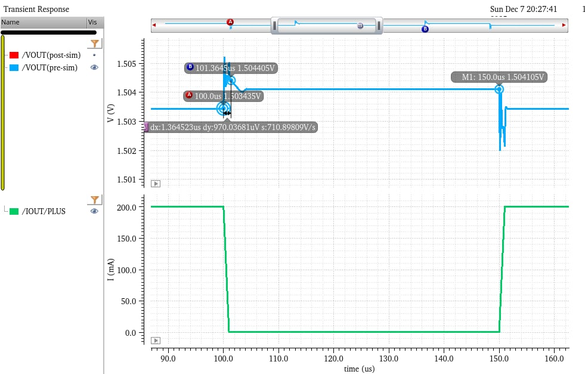
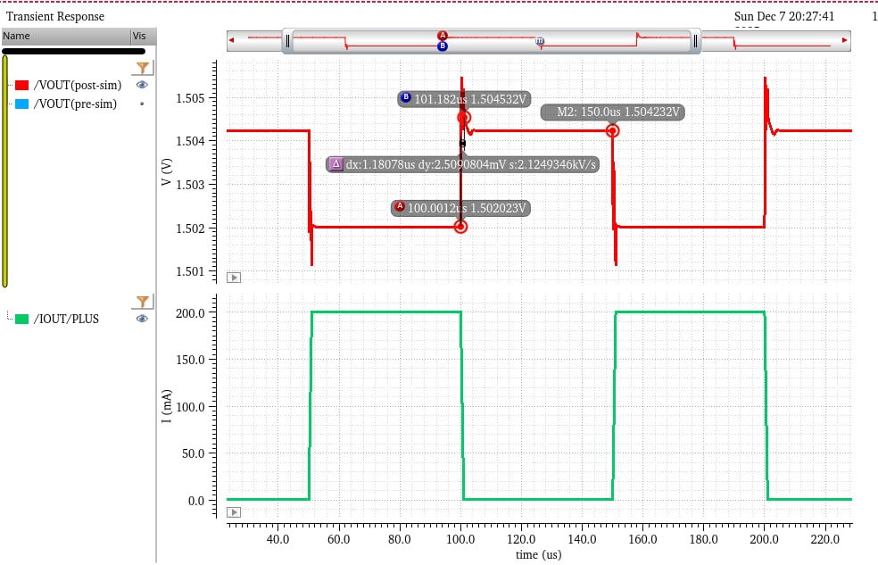
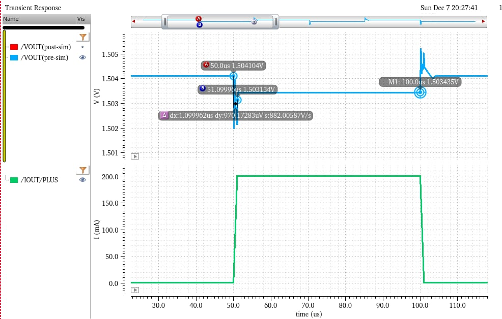

## Design Objective

This project presents the design, simulation, and layout verification of a **low-dropout regulator (LDO) with integrated I/O pads**, targeting **low-noise analog supply generation** for mixed-signal systems.

The design integrates a **bandgap reference** and a **high-gain error amplifier**, and focuses on **system-level stability, transient performance, and layout robustness under heavy load conditions**.

---

## System Architecture Overview

The LDO system consists of:

- **Bandgap Reference (BGR)**  
  Provides a temperature-stable reference voltage (~1.2 V)

- **Error Amplifier (EA)**  
  High-gain amplifier regulating the pass device gate voltage

- **PMOS Pass Device**  
  Large-width power transistor supplying up to **200 mA load current**

- **Feedback Network (RF1, RF2)**  
  Sets the regulated output voltage

- **Off-Chip Load Network**  
  Includes load capacitor (CL) and ESR to emulate real system conditions

- **I/O Pads**  
  VIN, VOUT, VREF, control, and ground pads with realistic parasitics

---

## Design Methodology

### 1. Pass Device Sizing

- Initial sizing was estimated assuming:
  - assume $V_{OUT}=1.5V and V_{GP} \approx 0.9V$
- Required PMOS width was first estimated to meet **200 mA load current**
- To reduce excessive parasitic capacitance:
  - Error amplifier RC compensation was removed
  - PMOS size was subsequently reduced while maintaining stability
- Final tuning balanced:
  - Load capability
  - Phase margin
  - Transient response

---
### 2. Stability Considerations

- Loop stability was evaluated using **STB analysis** with `iprobe`
- Phase margin was checked under:
  - Light load (1 mA)
  - Heavy load (200 mA)
- ESR zero from off-chip capacitor was leveraged to improve phase margin
- Trade-off between bandwidth and transient overshoot was carefully managed

---

### 3. Transient Response Optimization

- Load transient simulated with:
  - 1 mA → 200 mA → 1 mA step
  - Transition time within 1 µs
- Key metrics:
  - Overshoot voltage
  - Undershoot voltage
  - Recovery time (±0.02% of VOUT)

---

## Supply & Operating Conditions

| Parameter | Value |
|:---------:|:-----:|
| Process | UMC18 CMOS |
| VIN (VDD) | 1.8 – 2.0 V |
| VOUT | ~1.5 V |
| Load Current Range | 1 mA – 200 mA |
| Load Capacitor (CL) | 4.7 µF (off-chip) |
| ESR | 0 – 5 Ω |
| Temperature | 60 °C |
| Corner | TT (simulation requirement) |

---

## Device Parameters
| Parameter | Value |
|:---------:|:-----:|
| $R_{F1}$ | 30.0327kΩ |
| $R_{F2}$ | 127.358kΩ |
| $C_{L}$ | 4.7µ𝐹|
| $R_{CESR}$ | 50mΩ |
| $M_{P}$ | 100µ/0.18µ, mul=44 |
| MUX | PMOS:2µ/1µ, NMOS:1µ/1µ |

---

## Performance Summary

| Parameters | Pre-Simulation | Post-Simulation |
|:------:|:--------------:|:---------------:|
| VIN (VDD) | 1.8 – 2.0 V | 1.8 – 2.0 V |
| VOUT @ 100 mA | 1.50382 V | 1.50359 V |
| VREF (Bandgap Output) | 1.21404 V | 1.21301 V |
| Quiescent Current (IQ) | 120.758 µA | 176.174 µA |
| Overshoot Voltage | 1.75214 mV | 3.43333 mV |
| Undershoot Voltage | 2.10554 mV | 3.07700 mV |
| Recovery Time (H → L) | 1.36452 µs | 1.18078 µs |
| Recovery Time (L → H) | 1.09962 µs | 1.06912 µs |
| Line Regulation | 10.9713 mV/V | 11.1964 mV/V |
| Load Regulation | 3.36286 mV/A | 11.1415 mV/A |
| Power Efficiency @ 100 mA | 83.2040 % | 83.0744 % |
| Current Efficiency @ 100 mA | 99.8687 % | 99.8146 % |

---

## Load Transient (blue: pre-simulation/ red: post-simulation)

---

## Rcovery time (blue: pre-simulation/ red: post-simulation)
<table>
  <tr>
    <td align="center"><b></b></td>
    <td align="center"><b>Pre-Simulation</b></td>
    <td align="center"><b>Post-Simulation</b></td>
  </tr>

  <tr>
    <td align="center"><b>H → L</b></td>
    <td>
      
    </td>
    <td>
      
    </td>
  </tr>

  <tr>
    <td align="center"><b>L → H</b></td>
    <td>
      
    </td>
    <td>
      
    </td>
  </tr>

